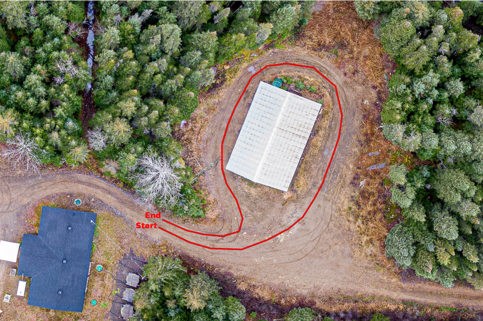
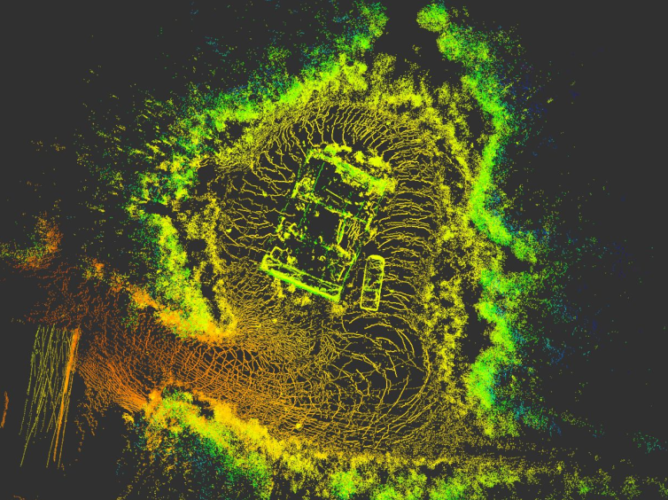

# Using norlab_icp_mapper in ROS

If you want to use norlab_icp_mapper in [ROS](http://www.ros.org/) or [ROS 2](https://docs.ros.org/en/iron/index.html), you can will need to install few more dependencies:

+ [libpointmatcher_ros](https://github.com/norlab-ulaval/libpointmatcher_ros) allows the conversion of pointclouds from ROS message formats to a libpointmatcher-compatible format and provides a mapping node that is already functional and that can be customized using YAML configuration files to suite your needs.
+ [norlab_icp_mapper_ros](https://github.com/norlab-ulaval/norlab_icp_mapper_ros) is a bridge between the mapper and ROS, providing message conversions to libpointmatcher compatible format.

## Tutorial

This tutorial is based on a 3D Mapping tutorial created by [Simon-Pierre Deschênes](https://norlab.ulaval.ca/people/sp_deschenes/) (Thanks 🎉).

### Copying the demonstration data

Assuming you completed the [Example: building a map from lidar scans](RunningExample.md) tutorial, we will now process ROS bag files.
Download the demonstration data using:

=== "ROS"
    TODO

=== "ROS 2"
    ```shell
    cd ~/
    wget -O demo.zip "http://norlab.s3.valeria.science/demo.zip?AWSAccessKeyId=XMBLP3A0338XN5LASKV2&Expires=2290342833&Signature=NXn1f%2BeJ7NptrzUkNzHtEvdicjc%3D"
    unzip demo.zip
    rm demo.zip
    ```

### Fetching libpointmatcher_ros

=== "ROS"
    ```shell
    cd ~/
    mkdir -p catkin_ws/src && cd catkin_ws/src/
    git clone -b melodic https://github.com/norlab-ulaval/libpointmatcher_ros.git
    ```

=== "ROS 2"
    ```shell
    cd ~/
    mkdir -p ros2_ws/src && cd ros2_ws/src/
    git clone https://github.com/norlab-ulaval/libpointmatcher_ros.git
    ```

### Fetching norlab_icp_mapper_ros
=== "ROS"
    ```shell
    cd ~/catkin_ws/src/
    git clone -b melodic https://github.com/norlab-ulaval/norlab_icp_mapper_ros.git
    ```

=== "ROS 2"
    ```shell
    cd ~/ros2_ws/src/
    git clone https://github.com/norlab-ulaval/norlab_icp_mapper_ros.git
    ```

### Fetching mapper_config_template
=== "ROS"
    ```shell
    cd ~/catkin_ws/src/
    git clone -b melodic https://github.com/norlab-ulaval/mapper_config_template.git
    ```

=== "ROS 2"
    ```shell
    cd ~/ros2_ws/src/
    git clone https://github.com/norlab-ulaval/mapper_config_template.git
    ```

### Compiling ros workspace

=== "ROS"
    ```shell
    cd ~/catkin_ws/
    catkin_make
    ```

=== "ROS 2"
    ```shell
    cd ~/ros2_ws/
    colcon build --symlink-install
    source ~/ros2_ws/install/setup.bash
    ```

### Mapping basics

#### Behind the scenes

Behind the scenes, the mapper node takes a lidar point cloud, registers it in the
existing map using libpointmatcher and add it at the right place in the map. All of
this is done while keeping track of the pose of the robot. During this process, some
filters are applied on point clouds before and after map updates. Furthermore, between
map updates (slow), the mapper continuously localizes the robot in the map (fast) to
ensure good localization at all times.

#### Configuration files

The mapper configuration template `params/config.yaml` contains four important sections :

* ICP parameters used by libpointmatcher to do the registration of new point clouds in the map.
* Input filters which are applied to the new point clouds before being processed.
* Post-processing filters which are applied to the map after adding the new point cloud.
* Mapper parameters that configure the mapper's update condition and MapperModules.

See [How to configure the Mapper](MapperConfiguration.md) guide for more details.

Finally, the ROS launch file is located in `launch/mapper.launch` for ROS and `launch/mapper.launch.py` for ROS 2.

<p align="center">
   
</p>

### Running the demo

=== "ROS"
    ```shell
    roscore
    rosparam set use_sim_time true
    roslaunch mapper_config_template mapper.launch
    rviz -d ~/demo/config.rviz
    rosbag play ~/demo/demo.bag --clock --keep-alive
    ```

=== "ROS 2"
    ```shell
    ros2 launch mapper_config_template mapper.launch.py
    rviz2 -d ~/demo/config.rviz
    ros2 bag play ~/demo/demo --clock
    ```



### Adjusting mapping parameters

#### Lowering the map density

Open the file `mapper.config` and change the following parameter:
```yaml
   PointDistanceMapperModule:
      minDistNewPoint: 0.5 -> 1.0
```

#### Changing the map update condition

Open the file `mapper.config` and change the following parameters:

```yaml
   updateCondition:
    type: overlap -> distance
    value: 0.5 -> 5.0
```

#### Removing points reflected from the robot's chassis

Open the file `mapper.config` and add the following lines in the `input` section:

```yaml
- BoundingBoxDataPointsFilter:
    xMin: -1.5
    xMax: 0.5
    yMin: -1
    yMax: 1
    zMin: -1
    zMax: 0.5
    removeInside: 1
```

#### Removing dynamic points

Open the file `mapper.config` and add the following lines in the `post` section:

```yaml
- SurfaceNormalDataPointsFilter:
    knn: 15

- CutAtDescriptorThresholdDataPointsFilter:
    descName: probabilityDynamic
    useLargerThan: 1
    threshold: 0.8
```

Then change the following MapperModule in the `mapperModule` portion of the `mapper` section:
```yaml
    ComputeDynamicsMapperModule:
      priorDynamic: 0.6
      thresholdDynamic: 0.9
      alpha: 0.8
      beta: 0.99
      beamHalfAngle: 0.01
      epsilonA: 0.01
      epsilonD: 0.01
```

#### Saving the map
You can save the map by calling the `/save_map` service. Similarly, use the `/save_trajectory` service to save the trajectory.
=== "ROS"
    ```shell
    rosservice call /save_map "map_file_name:
        data: '$HOME/demo/demo.vtk'"
    ```

=== "ROS 2"
    ```shell
    ros2 service call /save_map norlab_icp_mapper_ros/srv/SaveMap "{map_file_name: {data: '$HOME/demo/demo.vtk'}}"
    ```

### Final Result
You can visualize the final result in [ParaView](https://www.paraview.org/) or other point cloud viewer of your choice.
